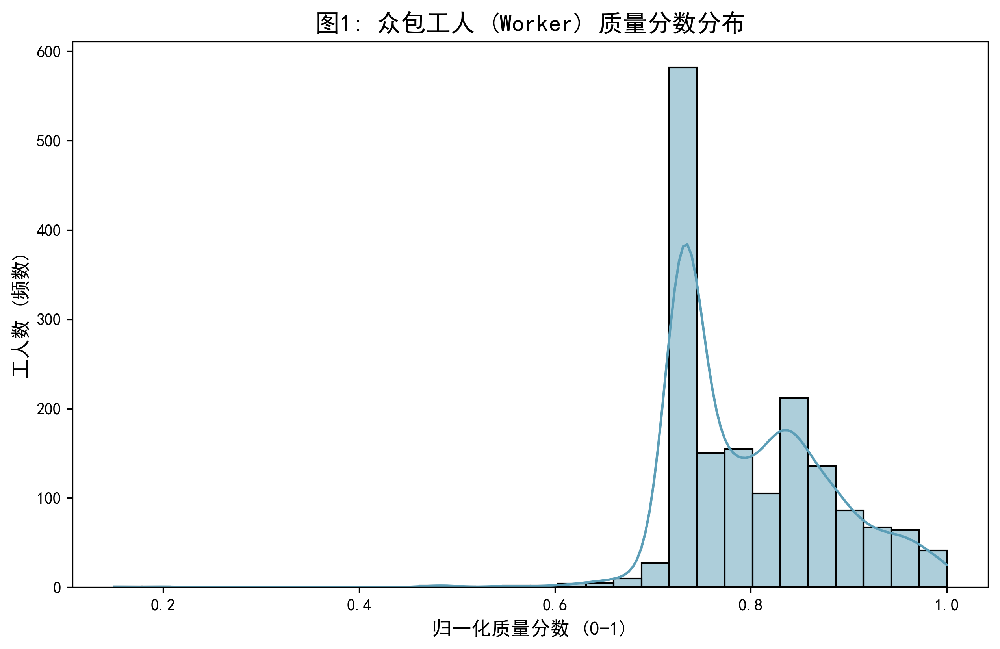
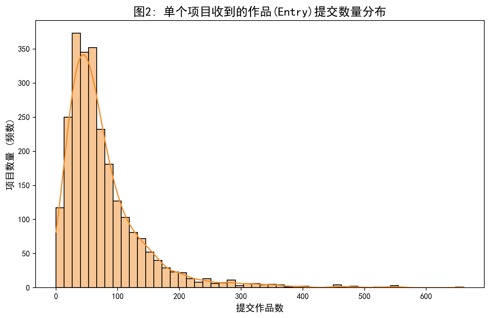
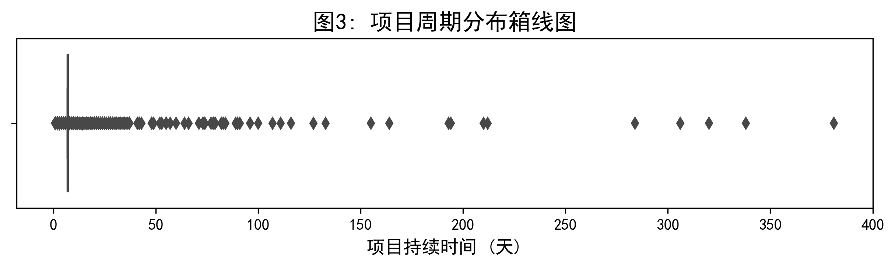

# JOB-01 数据探索 (EDA) 统计报告

## 1. 数据规模与时间范围

| 数据类别 | 数量 | 备注 |
|----------|------|------|
| Worker | 1807 个 | 其中 154 个 quality <= 0 被过滤，有效 1653 个 |
| Project | 2501 个 | 来自 `project_list.csv` |
| Entry | 约 191,525 条 | 基于 `project_list.csv` 各项目 entry 数求和；实际 entry 记录需解析 `entry/` 目录后确认 |

**时间范围**：需在 `data/project/` 和 `data/entry/` 数据齐全的环境下重跑脚本获取具体日期区间。

## 2. 关键统计表

### 2.1 Worker Quality 分布（归一化后，过滤 quality <= 0）

| 指标 | 值 |
|------|-----|
| 有效样本数 | 1653 |
| 被过滤数（quality <= 0） | 154 |
| 均值 | 0.7992 |
| 中位数 | 0.7800 |
| 标准差 | 0.0822 |
| 最小值 | 0.1500 |
| 最大值 | 1.0000 |

### 2.2 Per-Project Entry Count（来自 project_list.csv）

| 指标 | 值 |
|------|-----|
| 项目总数 | 2501 |
| 均值 | 76.58 |
| 中位数 | 59.00 |
| 标准差 | 66.19 |
| 最小值 | 0 |
| 最大值 | 661 |

### 2.3 Project Duration / Entry 详细统计

> 以下统计需在 `data/project/` 和 `data/entry/` 数据齐全的环境下运行 `src/data/eda.py` 获取：
> - Project duration（天）：均值、中位数、标准差
> - Entry award_value 分布
> - Per-worker entry 数分布
> - Finalist / Winner 比例
> - Entry 时间范围及其与 project deadline 的关系

运行命令：`python src/data/eda.py`

## 3. 关键图表与分布发现

以下图表均保存在 `docs/figures/` 目录下：

1. ****
   * **发现**：工人质量分数在过滤 quality <= 0 的 154 个异常值并归一化后，呈左偏分布，大部分工人集中在 0.7-0.9 区间。

2. ****
   * **发现**：绝大多数项目收到的作品提交数集中在 50 次以内（中位数 59），存在显著长尾，最大值为 661。

3. ****
   * **发现**：大部分项目的生命周期在几天到数周不等，存在少量极端长周期的异常项目。（需完整数据确认具体天数分布。）

4. 以下图表在 `data/entry/` 可用时由脚本自动生成：
   * `JOB-01-entry_award_value_distribution.png` — award_value 分布
   * `JOB-01-per_worker_entry_count.png` — 每位 worker 的 entry 提交数分布

## 4. 对下游任务的建议

1. **冷启动与稀疏性（给 JOB-02/06）**：大部分项目收到的提交集中在低端（中位数 59，但标准差 66），推荐系统在召回和划分数据集时，必须考虑长尾 project 的冷启动问题。

2. **字段名不一致（给 JOB-03）**：entry 数据中获取 worker ID 的实际 JSON key 是 `worker`，而 `docs/roadmap.md` §2 列为 `author`。`sample_read_data.py` 使用的是 `worker`。特征工程提取时需以实际 key 为准。

3. **奖励函数（给 JOB-07）**：worker quality 原始值范围 [-1, 100]，含 154 个 <= 0 的异常值（8.5%）。构建 Requester Reward 时必须沿用过滤（> 0）和归一化（/100）逻辑，避免负数导致 Q 值发散。

4. **Entry 分析（给 JOB-04/07）**：EDA 脚本已包含 entry 数据的完整分析逻辑（per-worker entry 数、award_value 分布、finalist/winner 比例、entry 时间分布），需在完整数据环境下重跑以获得具体数值。
