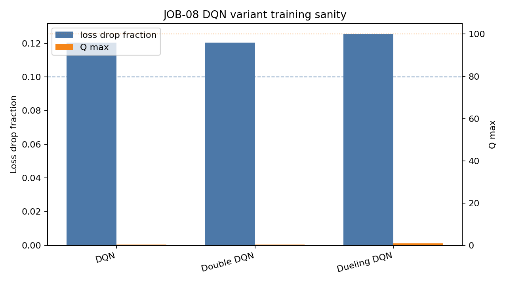

# DQN Models

## Architecture

The DQN family is implemented for variable-size recommendation candidate sets.
Instead of a fixed global action head, each model scores `Q(s, a)` from the
state vector and a per-candidate project feature vector.

Implemented variants:

| Variant | Implementation |
|---|---|
| Vanilla DQN | `src/rl/models/dqn.py` |
| Double DQN | target-network training flow in `src/rl/trainer.py` |
| Dueling DQN | `src/rl/models/dueling_dqn.py` |

`Double DQN` shares the pairwise scorer with vanilla DQN and uses separate
online/target networks in the trainer. The trainer implements online-action
selection plus target-network evaluation when a transition supplies `s_next`
and `gamma > 0`. In the current contextual-bandit environment, `s_next = None`
and `gamma = 0`, so Double DQN correctly degenerates to the immediate logged
reward target.

## Configuration

Checked-in configs:

| File | Purpose |
|---|---|
| `experiments/configs/dqn_baseline.yaml` | vanilla, Double DQN, and Dueling DQN defaults |

## Smoke Evidence

Executed 1000-step training-loop sanity runs on 1000 candidate-rich train
transitions:

```text
.venv/bin/python -m src.rl.trainer --objective worker --split train --model-kind dqn --max-transitions 1000 --max-steps 1000 --batch-size 256 --candidate-k 50 --seed 42 --min-candidates 2
steps: 1000
initial_loss: 0.07863883189857006
final_loss: 0.06916324868798256
loss_drop_fraction: 0.12049496389785264
q_max: 0.3717537522315979

.venv/bin/python -m src.rl.trainer --objective worker --split train --model-kind double_dqn --max-transitions 1000 --max-steps 1000 --batch-size 256 --candidate-k 50 --seed 42 --min-candidates 2
steps: 1000
initial_loss: 0.07863883189857006
final_loss: 0.06916324868798256
loss_drop_fraction: 0.12049496389785264
q_max: 0.3717537522315979

.venv/bin/python -m src.rl.trainer --objective worker --split train --model-kind dueling_dqn --max-transitions 1000 --max-steps 1000 --batch-size 256 --candidate-k 50 --seed 42 --min-candidates 2
steps: 1000
initial_loss: 0.07857492379844189
final_loss: 0.06823475398123265
loss_drop_fraction: 0.13159630728670568
q_max: 0.5794636011123657
```

All three variants exceed 10% loss drop over the 1000-step sanity run and keep
Q max below the JOB-08 threshold of 100.


