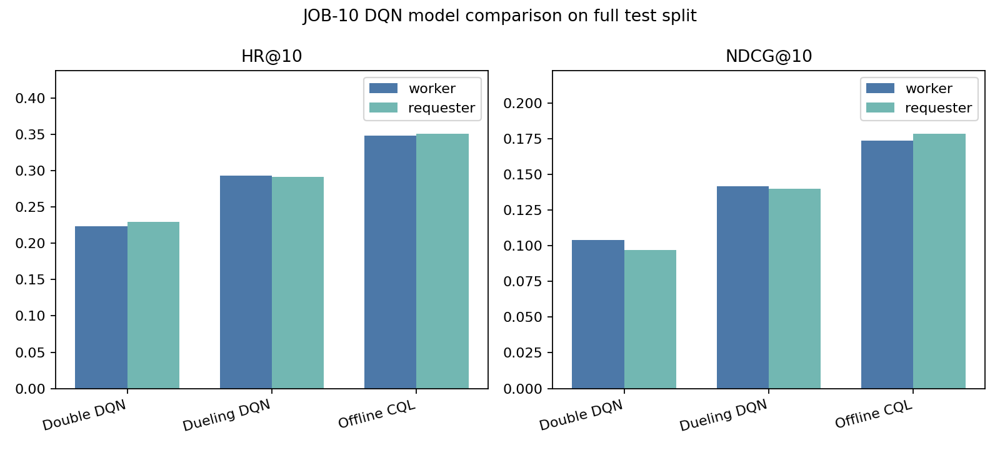

# DQN Results

- **Generated**: 2026-05-24 23:50
- **Command**: `.venv/bin/python -m src.rl.run_experiment --objective both --model-kind dueling_dqn --seeds 42,43,44 --max-transitions 1000 --train-split train --epochs 2 --max-steps 5000 --batch-size 256 --candidate-k 50 --eval-split test --max-eval-entries 0 --cql-alpha 1.0 --min-candidates 2 --output docs/dqn_results.md`
- **Candidate source**: JOB-06 fast candidate adapter with ground-truth injection.
- **Artifacts**: checkpoints and run diagnostics are under `outputs/dqn/` and are not committed.

## Baseline Comparison

The DQN runs use the same evaluator metric names and the same JOB-06
candidate adapter policy as the JOB-05 baselines. Existing baseline
results are reproduced below from `docs/baselines.md`.

### Generic Ranking Metrics

| Metric | Random | Popularity | CategoryMatch | QualityWeighted |
|---|---|---|---|---|
| HR@1 | 0.0206 | 0.0495 | 0.0158 | 0.0461 |
| HR@5 | 0.1074 | 0.2125 | 0.0621 | 0.2102 |
| HR@10 | 0.2167 | 0.3579 | 0.1290 | 0.3531 |
| NDCG@1 | 0.0206 | 0.0495 | 0.0158 | 0.0461 |
| NDCG@5 | 0.0627 | 0.1307 | 0.0388 | 0.1276 |
| NDCG@10 | 0.0976 | 0.1774 | 0.0597 | 0.1734 |
| MRR | 0.0944 | 0.1524 | 0.0768 | 0.1485 |
| Precision@1 | 0.0206 | 0.0495 | 0.0158 | 0.0461 |
| Precision@5 | 0.0215 | 0.0425 | 0.0124 | 0.0420 |
| Precision@10 | 0.0217 | 0.0358 | 0.0129 | 0.0353 |
| Recall@1 | 0.0206 | 0.0495 | 0.0158 | 0.0461 |
| Recall@5 | 0.1074 | 0.2125 | 0.0621 | 0.2102 |
| Recall@10 | 0.2167 | 0.3579 | 0.1290 | 0.3531 |

### Worker-Objective Metrics

| Metric | Random | Popularity | CategoryMatch | QualityWeighted |
|---|---|---|---|---|
| avg_award_value@1 | 67.9288 | 156.9550 | 59.6834 | 178.0509 |
| avg_award_value@5 | 67.4875 | 131.2475 | 57.4067 | 137.3110 |
| avg_award_value@10 | 67.7383 | 113.8419 | 66.0140 | 120.2591 |
| finalist_rate@1 | 0.0017 | 0.0032 | 0.0027 | 0.0041 |
| finalist_rate@5 | 0.0019 | 0.0027 | 0.0024 | 0.0029 |
| finalist_rate@10 | 0.0019 | 0.0027 | 0.0021 | 0.0028 |
| winner_rate@1 | 0.0017 | 0.0028 | 0.0026 | 0.0037 |
| winner_rate@5 | 0.0018 | 0.0026 | 0.0023 | 0.0028 |
| winner_rate@10 | 0.0019 | 0.0026 | 0.0021 | 0.0027 |
| category_match_rate@1 | 0.8915 | 0.9657 | 0.9990 | 0.9503 |
| category_match_rate@5 | 0.8909 | 0.9537 | 0.9895 | 0.9379 |
| category_match_rate@10 | 0.8908 | 0.9430 | 0.9797 | 0.9219 |

### Requester-Objective Metrics

| Metric | Random | Popularity | CategoryMatch | QualityWeighted |
|---|---|---|---|---|
| avg_recommender_worker_quality | 0.8894 | 0.8888 | 0.8918 | 0.8854 |
| project_coverage | 1.0000 | 0.5130 | 0.3525 | 0.5679 |

## Summary

### worker

| Metric | Mean | Std |
|---|---:|---:|
| HR@1 | 0.052693 | 0.003841 |
| HR@5 | 0.201072 | 0.006562 |
| HR@10 | 0.348489 | 0.002782 |
| NDCG@10 | 0.173339 | 0.004187 |
| MRR | 0.150308 | 0.004471 |
| avg_award_value@10 | 99.238726 | 10.043334 |
| finalist_rate@10 | 0.002366 | 0.000320 |
| winner_rate@10 | 0.002313 | 0.000318 |
| category_match_rate@10 | 0.884131 | 0.024492 |
| avg_recommender_worker_quality | 0.883494 | 0.007857 |
| project_coverage | 0.960677 | 0.033495 |

Training diagnostics:

| Seed | Transitions | Final loss | Q max | CQL penalty |
|---:|---:|---:|---:|---:|
| 42 | 1000 | 0.905078 | 2.083456 | 0.764545 |
| 43 | 1000 | 0.931585 | 2.050964 | 0.799146 |
| 44 | 1000 | 0.910970 | 2.306679 | 0.775594 |

### requester

| Metric | Mean | Std |
|---|---:|---:|
| HR@1 | 0.058389 | 0.019728 |
| HR@5 | 0.206311 | 0.047257 |
| HR@10 | 0.350524 | 0.052437 |
| NDCG@10 | 0.178190 | 0.035447 |
| MRR | 0.156237 | 0.028328 |
| avg_award_value@10 | 99.789195 | 7.782693 |
| finalist_rate@10 | 0.002814 | 0.000248 |
| winner_rate@10 | 0.002760 | 0.000249 |
| category_match_rate@10 | 0.910523 | 0.008560 |
| avg_recommender_worker_quality | 0.875210 | 0.004895 |
| project_coverage | 0.948331 | 0.033023 |

Training diagnostics:

| Seed | Transitions | Final loss | Q max | CQL penalty |
|---:|---:|---:|---:|---:|
| 42 | 1000 | 0.832470 | 2.439674 | 0.762851 |
| 43 | 1000 | 0.876955 | 2.705406 | 0.806588 |
| 44 | 1000 | 0.849256 | 2.554770 | 0.778904 |

## Model Coverage

All rows use the full test split with candidate `K=50` and three seeds for
both objectives.

| Model | Objective | HR@10 mean | HR@10 std | NDCG@10 mean | Project coverage mean |
|---|---|---:|---:|---:|---:|
| Double DQN (`cql_alpha=0.0`) | worker | 0.223631 | 0.068048 | 0.103857 | 0.964335 |
| Double DQN (`cql_alpha=0.0`) | requester | 0.229375 | 0.023500 | 0.096844 | 0.727938 |
| Dueling DQN (`cql_alpha=0.0`) | worker | 0.293037 | 0.055166 | 0.141678 | 0.966621 |
| Dueling DQN (`cql_alpha=0.0`) | requester | 0.291370 | 0.064272 | 0.139690 | 0.952904 |
| Offline CQL Dueling (`cql_alpha=1.0`) | worker | 0.348489 | 0.002782 | 0.173339 | 0.960677 |
| Offline CQL Dueling (`cql_alpha=1.0`) | requester | 0.350524 | 0.052437 | 0.178190 | 0.948331 |

## Ablation

- Executed ablation command:
  `.venv/bin/python -m src.rl.run_experiment --objective worker --model-kind dueling_dqn --seeds 42 --train-split train --max-transitions 1000 --max-steps 5000 --batch-size 256 --candidate-k 50 --eval-split test --max-eval-entries 0 --cql-alpha 0.0 --min-candidates 2 --output outputs/dqn_ablation.md`
- Worker seed 42, CQL alpha 1.0: `HR@10=0.351030`,
  `NDCG@10=0.174071`, `MRR=0.150465`,
  `avg_award_value@10=93.581815`, `project_coverage=0.997257`,
  `q_max=2.083456`.
- Worker seed 42, CQL alpha 0.0: `HR@10=0.371888`,
  `NDCG@10=0.189097`, `MRR=0.162907`,
  `avg_award_value@10=109.181815`, `project_coverage=0.993141`,
  `q_max=8.641329`.
- On this run the vanilla ablation ranks slightly better, while CQL reduces
  `q_max` by 75.9% and keeps the final tail-growth diagnostic below 5%.

## Notes

- These runs use the same evaluator metric names as JOB-04.
- The checked-in report uses the full test split with candidate `K=50`; training
  uses 1000 candidate-rich logged transitions and 5000 optimizer steps per seed.
- Larger final experiments can reuse the same scripts with larger
  `--max-transitions` and `--max-steps` values.
