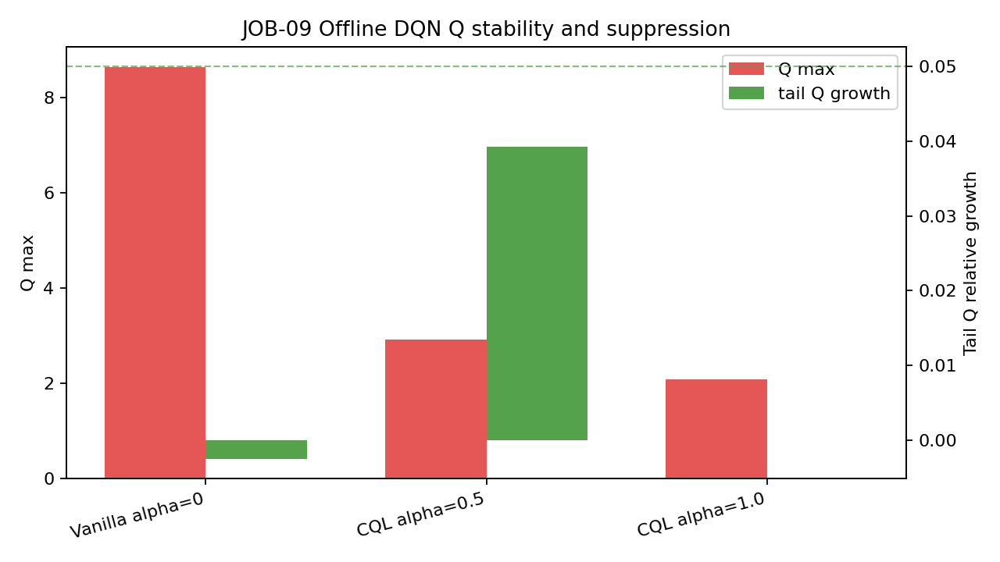

# Offline DQN

## Why Offline Regularization Is Needed

The project has historical recommendation logs only. A plain DQN can assign
over-optimistic values to actions outside the behavior data support. The DQN
mainline therefore adds Conservative Q-Learning as the default offline
regularizer.

## Selected Method

CQL is implemented in `src/rl/models/cql.py` and used by `src/rl/trainer.py`:

```text
loss = Huber(Q(s, a_data), r)
     + alpha * (logsumexp(Q(s, candidates)) - Q(s, a_data))
```

The logged action is guaranteed to be in `candidates` by the environment's
ground-truth injection policy.

## Hyperparameters

| Setting | Value used in bounded diagnostics |
|---|---:|
| model | dueling_dqn |
| objective | worker |
| candidate_k | 50 |
| train split | train |
| transitions | 1000 candidate-rich rows |
| epochs | 5000 |
| batch_size | 256 |
| seed | 42 |

## Bounded Diagnostics

Vanilla bounded run:

```text
cql_alpha: 0.0
steps: 5000
initial_loss: 0.07857492379844189
final_loss: 0.057060619816184044
loss_drop_fraction: 0.2738062341294242
q_max: 8.641328811645508
q_mean_last: 7.34962306022644
q_tail_relative_growth: -0.0025176634895032694
cql_penalty_last: 1.4922277927398682
behavior_top1_overlap_last: 0.2400323286652565
```

CQL alpha 0.5 diagnostic:

```text
cql_alpha: 0.5
steps: 5000
initial_loss: 0.7996349990367889
final_loss: 0.523534494638443
loss_drop_fraction: 0.345283166358309
q_max: 2.918062210083008
q_mean_last: 1.594255256652832
q_tail_relative_growth: 0.03919493113530731
cql_penalty_last: 0.8243064224720001
behavior_top1_overlap_last: 0.6930630385875702
```

1000-transition selected diagnostic:

```text
cql_alpha: 1.0
steps: 5000
initial_loss: 1.5206296801567079
final_loss: 0.9050780653953552
loss_drop_fraction: 0.4048004736418911
q_max: 2.083456039428711
q_mean_last: 1.239732575416565
q_tail_relative_growth: 0.000015479689544840113
cql_penalty_last: 0.7645449757575988
behavior_top1_overlap_last: 0.6979660570621491
```

The 1000-transition selected CQL run keeps Q values below 100, has final-window
Q growth below 5%, and lowers Q max from the alpha-zero diagnostic's 8.6413 to
2.0835, a 75.9% reduction. It also increases behavior top-1 overlap from 0.24
to 0.70 on the same sample.


