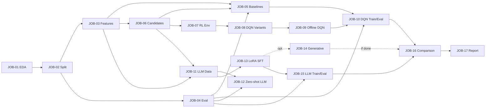

# 项目推进计划:DQN + LLM+SFT 双主线方案

本文档是项目的**总体推进计划**和**进度表**。所有 job 的详细说明在 [`docs/jobs/`](./jobs/)。

> **维护规则**:
> 1. 任何 agent 在开始/完成 job 时,必须同步更新本文档「进度表」一节的 Status 列。
> 2. job 详情(背景、输入、产出、验收)只在 `docs/jobs/JOB-XX-*.md` 维护,本文档只记录索引和状态。
> 3. 若新增/拆分/合并 job,需同步更新「进度表」、「依赖关系」和 `docs/jobs/` 文件。

---

## 1. 方案定位

作业明确要求**使用 DQN 系列模型**,因此 **DQN 是主交付**。本项目同时并行一条 **LLM+SFT** 实验线,定位如下:

| 方案 | 定位 | 在最终报告中的位置 |
|------|------|--------------------|
| **DQN 主线** | 满足作业硬性要求,作为主结果 | 「方法」「主实验」「结论」核心章节(≥ 60% 篇幅) |
| **LLM+SFT 主线** | 方法对比实验,展示 LLM 推荐范式在众包域的迁移能力 | 「拓展实验:LLM 推荐对比」单独章节(≤ 30% 篇幅) |

**为什么并行 LLM 主线**:文献调研发现,**LLM 用于众包任务推荐方向接近空白**(参见 [JOB-11](./jobs/JOB-11-llm-data-construction.md) 引用),具有差异化研究价值;同时作为非 RL baseline,为 DQN 实验结论提供更强的对比基线。

---

## 2. 数据与核心约束

- **数据来源**:crowdSPRING(设计众包平台,2009 起 logo/banner 等设计任务),约 2500 个 project、1800 个 worker、22800+ entry 文件。详见 [JOB-01](./jobs/JOB-01-data-eda.md)。
- **关键字段**(已通过实际读取 `data/entry/entry_*.txt` 和 `data/project/project_*.txt` 确认存在;`sample_read_data.py` 仅读取其中一个子集,完整字段以 JOB-01 EDA 报告为准):
  - **entry**:`author`(=worker_id)、`entry_created_at`、`award_value`(美元奖金)、`offer_value`、`tip_value`、`finalist`(bool)、`winner`(bool)、`eliminated`、`withdrawn`、`entry_type`、`entry_number`、`project`
  - **project**:`id`、`title`(自然语言)、`category`、`sub_category`、`industry`(可能为 `None`)、`start_date`、`deadline`、`status`、`entry_count`、`creative_count`、`average_score`、`total_awards`、`brief_questions`/`brief_answers`(自然语言任务描述,LLM 主线可直接用)、`package_name`、`participants`
  - **worker**:`worker_quality` ∈ [-1, 100],样例代码会过滤 ≤ 0 的值并归一化到 [0, 1]
- **核心约束 — Offline RL**:只有历史日志,无法在线交互。所有 DQN 训练必须按离线 RL 处理(参考 CQL / Discrete BCQ)。
- **数据划分**:必须按**时序**划分(避免数据泄漏),不能随机 split。详见 [JOB-02](./jobs/JOB-02-data-split.md)。

---

## 3. 总体路线图

```
Phase A: 共同前置          Phase B: DQN 主线            Phase D: 收尾
JOB-01 数据 EDA       ┐    JOB-06 候选集生成 ★     ┐
JOB-02 数据划分       │    JOB-07 Env 抽象          │
JOB-03 公共特征工程   ├──→ JOB-08 DQN 模型实现      ├──→ JOB-16 对比分析
JOB-04 评估框架       │    JOB-09 Offline DQN       │    JOB-17 报告与答辩
JOB-05 Baseline       ┘    JOB-10 双目标训练评估    │
                                                    │
                           Phase C: LLM+SFT 主线    │
                           JOB-11 数据构造+Prompt ★ │  (★ = JOB-11 也依赖 JOB-06,
                           JOB-12 Zero-shot 基线   ─┤    LLM 主线需要等 JOB-06)
                           JOB-13 LoRA SFT 管线    │
                           JOB-14 生成式+grounding │ (可选)
                           JOB-15 双目标训练评估    ┘
```

**并行性**:Phase B 和 Phase C 的内部串行链可在 **JOB-06 完成后**并行展开(JOB-06 是共享前置)。Phase A 内部 JOB-01 → 02 → 03/04/05 有依赖,详见「依赖关系」。

---

## 4. 进度表

| ID | Job | Phase | Status | Owner | 依赖 |
|----|-----|-------|--------|-------|------|
| [JOB-01](./jobs/JOB-01-data-eda.md) | 数据 EDA 与统计报告 | A | ⬜ Pending | - | - |
| [JOB-02](./jobs/JOB-02-data-split.md) | 数据集时序划分 + 冷启动协议 | A | ⬜ Pending | - | JOB-01 |
| [JOB-03](./jobs/JOB-03-feature-engineering.md) | 公共特征工程 | A | ⬜ Pending | - | JOB-01, JOB-02 |
| [JOB-04](./jobs/JOB-04-evaluation-framework.md) | 评估框架与指标 | A | ⬜ Pending | - | JOB-02 |
| [JOB-05](./jobs/JOB-05-baselines.md) | Baseline 推荐策略 | A | ⬜ Pending | - | JOB-03, JOB-04, JOB-06 |
| [JOB-06](./jobs/JOB-06-candidate-generation.md) | 候选集生成模块(共享) | B | ⬜ Pending | - | JOB-03 |
| [JOB-07](./jobs/JOB-07-rl-env.md) | 推荐环境抽象(Env) | B | ⬜ Pending | - | JOB-03, JOB-06 |
| [JOB-08](./jobs/JOB-08-dqn-variants.md) | DQN/Double/Dueling 模型 | B | ⬜ Pending | - | JOB-07 |
| [JOB-09](./jobs/JOB-09-offline-dqn.md) | Offline DQN(CQL/BCQ) | B | ⬜ Pending | - | JOB-08 |
| [JOB-10](./jobs/JOB-10-dqn-train-eval.md) | DQN 双目标训练与评估 | B | ⬜ Pending | - | JOB-09, JOB-04, JOB-05 |
| [JOB-11](./jobs/JOB-11-llm-data-construction.md) | LLM 数据构造与 Prompt | C | ⬜ Pending | - | JOB-03, JOB-06 |
| [JOB-12](./jobs/JOB-12-llm-zero-shot.md) | Zero-shot LLM 基线 | C | ⬜ Pending | - | JOB-11, JOB-04 |
| [JOB-13](./jobs/JOB-13-llm-lora-sft.md) | LoRA SFT 训练管线 | C | ⬜ Pending | - | JOB-11 |
| [JOB-14](./jobs/JOB-14-llm-generative.md) | 生成式 SFT + grounding(可选) | C | 🟡 Optional | - | JOB-13 |
| [JOB-15](./jobs/JOB-15-llm-train-eval.md) | LLM 双目标训练与评估 | C | ⬜ Pending | - | JOB-13, JOB-04 |
| [JOB-16](./jobs/JOB-16-comparison.md) | DQN vs LLM 对比分析 | D | ⬜ Pending | - | JOB-10, JOB-15 |
| [JOB-17](./jobs/JOB-17-report.md) | 实验报告与答辩材料 | D | ⬜ Pending | - | JOB-16 |

**Status 取值**:⬜ Pending / 🔵 In Progress / ✅ Completed / 🟡 Optional / ⛔ Blocked

---

## 5. 依赖关系图

依赖关系**以各 job 文件 § 依赖字段为准**,本图仅作可视化参考。



---

## 6. 关键技术决策(基于文献调研)

> 这些是**默认建议**,执行 job 时可根据实际数据 / 算力调整。改动需在对应 job 文档里说明。

### DQN 主线

- **必读对照论文**:**Shan et al. 2019**, "An End-to-End Deep Reinforcement Learning Framework for Task Arrangement in Crowdsourcing Platforms"([arXiv:1911.01030](https://arxiv.org/abs/1911.01030))—— 双 DQN 分别建模 worker / requester 利益,与本任务高度对齐。
- **基础架构**:Double DQN(Hasselt et al., [arXiv:1509.06461](https://arxiv.org/abs/1509.06461))+ Dueling DQN(Wang et al., [arXiv:1511.06581](https://arxiv.org/abs/1511.06581))。推荐场景里把两者组合使用的代表工作 DRN(Zheng et al., WWW 2018, [DOI:10.1145/3178876.3185994](https://doi.org/10.1145/3178876.3185994))
- **离线 RL**:CQL([arXiv:2006.04779](https://arxiv.org/abs/2006.04779))或 Discrete BCQ([GitHub](https://github.com/sfujim/BCQ))。**强烈建议至少跑一个**,否则朴素 DQN 在 offline log 上会出现 OOD 动作高估。
- **大动作空间**:候选集预召回(Top-K = 50~200),避免对所有 ~2500 个 project 直接做 argmax。两阶段做法参考 [ACM WWW 2023](https://dl.acm.org/doi/fullHtml/10.1145/3543873.3587661)。
- **MDP 默认形态**:**默认采用 contextual bandit**(只学 `Q(s, a)`,不建模 transition `s → s'`)。理由:本任务每个 worker 到达事件互相独立、reward 即时可观、推荐系统主流采用此形态。如 owner 在 JOB-07 选择真 MDP(带 transition),必须在 `docs/rl_env.md` 给出明确选择和理由。
- **双目标处理**:训练两个独立 DQN(worker reward、requester reward),report Pareto 比较。或加权 reward 训单模型作 ablation。

### LLM+SFT 主线

- **底座默认**:**Qwen2.5-3B-Instruct 或 Llama-3.2-3B-Instruct**(2024 主流 3B 系列,LoRA / QLoRA 显存友好,本地 12-24GB 卡可跑)。**若 owner 实测有 ≥ 24GB 卡** 可升级到 Qwen2.5-7B / Llama-3.1-8B。**完全无本地 GPU** 可降级到云端 API(OpenAI gpt-4o-mini / DeepSeek-V3 / Claude-Haiku)。
- **微调方式**:LoRA rank ∈ {8, 16},显存紧张用 QLoRA(4-bit)。
- **范式**:**TALLRec 风格 binary SFT**(`"worker 历史 X, project Y 是否适合? Yes/No"`)作为主方案,稳定且不会幻觉。[arXiv:2305.00447](https://arxiv.org/abs/2305.00447)
- **进阶可选**:BIGRec 生成式 + grounding([arXiv:2308.08434](https://arxiv.org/abs/2308.08434)),作为 JOB-14。
- **两阶段架构**:JOB-06 候选集 → LLM 排序,避免上下文塞 2500 个 project。
- **训练框架**:LLaMA-Factory([GitHub](https://github.com/hiyouga/LLaMA-Factory))或 Unsloth([GitHub](https://github.com/unslothai/unsloth))。

### 评估

- **统一指标**:HR@K、NDCG@K、MRR(K ∈ {1, 5, 10}),所有方案必须报这套。详见 [JOB-04](./jobs/JOB-04-evaluation-framework.md)。
- **双目标具体指标**(口径与 JOB-04 文档保持一致):
  - 参与者(worker)目标:`avg_award_value@K`、`finalist_rate@K`、`winner_rate@K`、`category_match_rate@K`
  - 请求者(requester)目标(以 project 视角统计):`avg_recommender_worker_quality`、`project_coverage`、`entry_count_uplift`(可选)
- **统计显著性**:DQN 多 seed(≥ 3)训练,报 mean ± std。LLM 训练贵,允许 ≥ 2 seed,std 计算保留各自 N。

---

## 6.5 接口契约表(跨 job 共享,改动需通知所有依赖方)

> 任何 job 实现以下接口时**必须遵守签名和返回类型**。改动需在 PR 描述里列出所有受影响 job,并通过 review。

| 接口 | 拥有 job | 签名 | 返回类型 |
|------|----------|------|----------|
| `load_split(name)` | JOB-02 | `name: Literal["train","val","test"]` | `EntryList`(dataclass,字段:`entries: list[Entry]`,`time_range: tuple[datetime, datetime]`) |
| `build_features(split_name)` | JOB-03 | `split_name: Literal["train","val","test"]` | `dict[str, np.ndarray]`(键:`worker_features`、`project_features`、`interaction_features`)。**若 JOB-03 owner 选用 pandas/tensor,需在 JOB-03 实现 `to_numpy()` 适配,保证消费方拿到的是 `np.ndarray`** |
| `get_candidates(worker_id, timestamp, K)` | JOB-06 | `worker_id: int, timestamp: datetime, K: int = 50` | `list[int]`(候选 project_id 列表,按召回得分降序) |
| `recommend(worker_id, timestamp, candidates)` | JOB-04(定义 `HasRecommend` Protocol);实现方:baseline(JOB-05)/ DQN(JOB-10)/ LLM(JOB-12/15) | `worker_id: int, timestamp: datetime, candidates: list[int]` | `list[int]`(排序后的 project_id 列表) |
| `evaluate(model, split)` | JOB-04 | `model: HasRecommend, split: Literal[...]` | `dict[str, float]`(所有指标) |
| `iter_transitions(split)` | JOB-07 | `split: str` | `Iterator[Transition]`(dataclass,字段:`s, a, r, s_next, candidates, info`) |
| `build_dataset(objective, split)` | JOB-11 | `objective: Literal["worker","requester"], split: str` | `Path`(写出的 jsonl 文件路径) |

**Reward(per-step) → Metric(aggregated)映射**(JOB-07 reward 与 JOB-04 metric 的对应):

| 目标 | per-step reward(JOB-07) | aggregated metric(JOB-04) |
|------|--------------------------|------------------------------|
| worker | `award_value + α·finalist + β·winner + γ·category_match` | `avg_award_value@K` / `finalist_rate@K` / `category_match_rate@K` |
| requester | `worker_quality(被推荐 worker 的质量)` | `avg_recommender_worker_quality` / `project_coverage` |

---

## 7. 风险与变更管理

| 风险 | 影响 | 缓解 |
|------|------|------|
| 数据规模超预期(entry 解压可能数百 MB) | EDA 慢 | JOB-01 做采样统计,完整跑 batch |
| Offline RL 不收敛 / 高估严重 | JOB-10 卡住 | JOB-09 早期跑 sanity check(reward distribution、Q value 监控) |
| LLM SFT 算力不足 | JOB-13 卡住 | roadmap §6 已默认 3B + QLoRA;再不行用云端 API |
| DQN 与 LLM 候选集口径不一致,不可比 | JOB-16 无意义 | **JOB-06 同时服务两条线,所有方案(含 baseline)统一用 JOB-06 候选集** |
| 冷启动 worker / 空 active project 边界场景未统一处理 | 评估口径不一致 | JOB-02 产出冷启动协议,JOB-03/06/07/11 全部遵守 |

**变更管理**:任何 job 的目标、产出、依赖发生变化,必须更新 `docs/jobs/JOB-XX-*.md` 和本文档对应行。变更记录写在 commit message。

---

## 8. 协作约定

- **领取 job**:在「进度表」对应行填 Owner,Status 改为 🔵 In Progress。
- **提交 job**:对应 PR 标题前缀 `[JOB-XX]`,描述里附上 job 文件链接和实际产出文件清单。
- **依赖未完成时**:不要预先开始下游 job,优先帮助上游 job。如需提前介入,在 PR 描述里说明。
- **agent 接手**:把 `docs/jobs/JOB-XX-*.md` 完整内容连同本 roadmap 一起作为上下文交给 agent,agent 不需要额外的项目背景。
- **图表命名**:`docs/figures/` 下文件统一前缀 `JOB-XX-*.png`,避免跨 job 冲突。
- **secrets / API keys**:任何 API key、token 必须用环境变量,**禁止入 Git**;在 `experiments/configs/` 用占位符。
